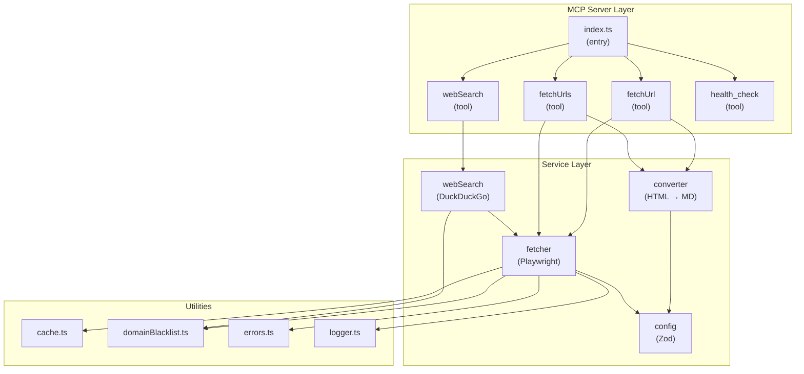

# markdown-for-agents-mcp

[](https://www.npmjs.com/package/markdown-for-agents-mcp)
[](https://www.npmjs.com/package/markdown-for-agents-mcp)
[](https://nodejs.org)
[](https://codecov.io/gh/JohnnyFoulds/markdown-for-agents-mcp)
[](LICENSE)

An [MCP (Model Context Protocol)](https://modelcontextprotocol.io) server that fetches URLs with **full JavaScript rendering** and converts them to clean, token-efficient markdown for AI agents.

Most MCP fetch tools use plain HTTP — they see what a server sends without running any JavaScript. That works for static sites, but silently returns empty or broken content for **React, Vue, Angular, SPAs, and any page that loads data dynamically**. This server runs a real Chromium browser via [Playwright](https://playwright.dev), so it renders the full page before extraction — the same content a human user would see.

Powered by [Playwright](https://playwright.dev) and the [`markdown-for-agents`](https://www.npmjs.com/package/markdown-for-agents) library. Strips ads, navigation, and boilerplate — delivering up to 80% fewer tokens than raw HTML.

---

## Why Playwright?

| Capability | Plain HTTP fetchers | markdown-for-agents-mcp |
| --- | --- | --- |
| Static HTML pages | ✅ | ✅ |
| React / Vue / Angular apps | ❌ | ✅ |
| JavaScript-rendered content | ❌ | ✅ |
| Single-page app routes | ❌ | ✅ |
| Lazy-loaded / infinite-scroll | ❌ | ✅ |
| Token efficiency vs raw HTML | Medium | Up to 80% fewer |
| Bot-detection evasion | None | UA rotation, webdriver spoofing |

**Token reduction example:** a typical news article page is ~150 KB of raw HTML (~40,000 tokens). After Playwright rendering, DOM pruning, and markdown conversion the same article becomes ~2,000 tokens — a 95% reduction.

---

## Table of Contents

- [Why Playwright?](#why-playwright)
- [Features](#features)
- [Installation](#installation)
- [MCP Client Setup](#mcp-client-setup)
- [Available Tools](#available-tools)
  - [fetch_url](#fetch_url)
  - [fetch_urls](#fetch_urls)
  - [web_search](#web_search)
  - [download_file](#download_file)
  - [health_check](#health_check)
- [CLI Usage](#cli-usage)
- [Configuration](#configuration)
- [Security](#security)
- [Architecture](#architecture)
- [Development](#development)
- [Troubleshooting](#troubleshooting)
- [Contributing](#contributing)
- [Changelog](#changelog)
- [License](#license)

---

## Features

- **JavaScript Rendering** — Playwright-driven Chromium renders React, Vue, Angular, and any JS-heavy page before extraction
- **Structured Output** — Tools return typed `structuredContent` (url, title, markdown, fetchedAt, contentSize) alongside the text response, compatible with MCP SDK 1.11+
- **Smart Content Extraction** — Scores and selects the main content block (`main` > `article` > `#content` > `body`), dropping sidebars, nav, and ads automatically
- **Token Efficiency** — Produces compact LLM-ready markdown; benchmarks show up to 80% fewer tokens than raw HTML
- **Web Search** — DuckDuckGo search with optional fetch-and-convert of top results
- **LRU Cache** — 50 MB in-memory cache with a 15-minute TTL avoids redundant fetches
- **Domain Filtering** — Built-in blocklist of trackers/social domains; supports per-request allow/block lists and server-level allowlist mode
- **Batch Fetching** — Concurrent multi-URL fetches with configurable parallelism
- **HTTP Server Mode** — Run as an HTTP server (`--http [port]` or `HTTP_PORT` env var) with optional bearer token auth
- **Proxy Support** — Pass `PLAYWRIGHT_PROXY` to route Playwright traffic through a proxy
- **Health Monitoring** — `health_check` tool exposes cache and fetch metrics
- **Zero Configuration** — Chromium is installed automatically on first run

---

## Installation

```bash
npm install -g markdown-for-agents-mcp
```

Chromium is downloaded automatically via the `postinstall` script. If that fails, see [Troubleshooting](#troubleshooting).

You can also run without installing globally using `npx`:

```bash
npx markdown-for-agents-mcp
```

---

## MCP Client Setup

Add the server to your MCP client configuration.

### Claude Desktop

Edit `~/Library/Application Support/Claude/claude_desktop_config.json` (macOS) or `%APPDATA%\Claude\claude_desktop_config.json` (Windows):

```json
{
  "mcpServers": {
    "markdown": {
      "command": "markdown-mcp"
    }
  }
}
```

### VS Code (Copilot / Continue)

Add to your workspace or user `settings.json` under the relevant MCP extension key, for example:

```json
{
  "mcpServers": {
    "markdown": {
      "command": "markdown-mcp"
    }
  }
}
```

### Cursor / Windsurf / Zed

Any client that implements the [MCP specification](https://modelcontextprotocol.io/specification) can use this server. The command entry point is `markdown-mcp` (available on `PATH` after global install) or the full path to `dist/index.js` for local builds.

### With environment variable overrides

```json
{
  "mcpServers": {
    "markdown": {
      "command": "markdown-mcp",
      "env": {
        "FETCH_TIMEOUT_MS": "60000",
        "LOG_LEVEL": "DEBUG"
      }
    }
  }
}
```

### HTTP server mode

Instead of stdio, you can run the server as a standard HTTP endpoint — useful for shared deployments, Docker, or any client that prefers the Streamable HTTP transport:

```bash
# Start on port 3456
markdown-mcp --http 3456

# Or use the env var
HTTP_PORT=3456 markdown-mcp
```

All MCP traffic is handled at `POST|GET|DELETE /mcp`. To require a bearer token, set `MCP_AUTH_TOKEN`:

```bash
MCP_AUTH_TOKEN=mysecrettoken HTTP_PORT=3456 markdown-mcp
```

Clients must then pass `Authorization: Bearer mysecrettoken` with every request.

---

## Available Tools

### `fetch_url`

Fetches a single URL with full JavaScript rendering and returns clean markdown.

**Arguments:**

| Name | Type | Required | Description |
|------|------|----------|-------------|
| `url` | string | yes | URL to fetch and convert |
| `timeout` | number | no | Request timeout in ms (overrides `FETCH_TIMEOUT_MS`) |

**Example:**

```
fetch_url(url="https://example.com/blog/post")
```

**Text output** (always present, backward-compatible):

```markdown
# Blog Post Title

Source: https://example.com/blog/post

This is the main content of the article, stripped of navigation, ads, and boilerplate.

## Related Section

More content here...

---
*Converted by markdown-for-agents-mcp*
```

**Structured output** (available to MCP SDK 1.11+ clients via `structuredContent`):

```json
{
  "url": "https://example.com/blog/post",
  "title": "Blog Post Title",
  "markdown": "# Blog Post Title\n\nSource: ...",
  "fetchedAt": "2026-04-06T17:00:00.000Z",
  "contentSize": 2048
}
```

---

### `fetch_urls`

Fetches multiple URLs concurrently and returns combined markdown, one section per URL.

**Arguments:**

| Name | Type | Required | Description |
|------|------|----------|-------------|
| `urls` | string[] | yes | URLs to fetch |
| `timeout` | number | no | Per-request timeout in ms |

**Example:**

```
fetch_urls(urls=[
  "https://example.com/post1",
  "https://example.com/post2"
])
```

**Text output:**

```markdown
# Post 1 Title

Source: https://example.com/post1

...

---

# Post 2 Title

Source: https://example.com/post2

...

---
```

**Structured output** (via `structuredContent`):

```json
{
  "results": [
    {
      "url": "https://example.com/post1",
      "title": "Post 1 Title",
      "markdown": "...",
      "fetchedAt": "2026-04-06T17:00:00.000Z",
      "contentSize": 1820,
      "success": true
    },
    {
      "url": "https://example.com/post2",
      "title": "Post 2 Title",
      "markdown": "...",
      "fetchedAt": "2026-04-06T17:00:00.000Z",
      "contentSize": 2104,
      "success": true
    }
  ],
  "summary": { "total": 2, "succeeded": 2, "failed": 0 }
}
```

Parallelism is controlled by `MAX_CONCURRENT_FETCHES` (default: 5).

---

### `web_search`

Searches DuckDuckGo and optionally fetches top results as markdown. Uses a plain HTTP endpoint to avoid bot detection — no Playwright for the search itself.

**Arguments:**

| Name | Type | Required | Description |
|------|------|----------|-------------|
| `query` | string | yes | Search query |
| `maxResults` | number | no | Max results to return (default: 10) |
| `allowedDomains` | string[] | no | Only include results from these domains |
| `blockedDomains` | string[] | no | Exclude results from these domains |
| `fetchResults` | boolean | no | Fetch and convert top result pages to markdown |
| `timeout` | number | no | Request timeout in ms |

**Example — search only:**

```
web_search(
  query="typescript tutorials",
  maxResults=5,
  allowedDomains=["typescriptlang.org", "github.com"]
)
```

**Example — search and fetch:**

```
web_search(
  query="react hooks guide",
  fetchResults=true,
  maxResults=3
)
```

**Text output:**

```markdown
# Web Search Results

## Query: typescript tutorials
**Found 5 results in 1234ms**

### Results:

1. [TypeScript Handbook](https://www.typescriptlang.org/docs/)
   The TypeScript Handbook provides comprehensive documentation...

2. [Best TypeScript Tutorials](https://github.com/danistefanovic/build-your-own-typescript)
   Learn TypeScript by building your own compiler...
```

**Structured output** (via `structuredContent`):

```json
{
  "query": "typescript tutorials",
  "results": [
    { "title": "TypeScript Handbook", "url": "https://www.typescriptlang.org/docs/", "snippet": "...", "domain": "typescriptlang.org" }
  ],
  "fetchedContent": [
    { "url": "https://www.typescriptlang.org/docs/", "markdown": "..." }
  ],
  "durationMs": 1234
}
```

> **Note:** `allowedDomains` and `blockedDomains` arguments apply to search result filtering only. Server-level `BLOCKLIST_DOMAINS` / `USE_ALLOWLIST_MODE` settings still apply when those results are subsequently fetched.

---

### `download_file`

Downloads a binary file (PDF, image, ZIP, etc.) from a URL and saves it to a local path. Uses a plain HTTP client — no Playwright required. SSRF protection and domain block list are enforced.

**Arguments:**

| Name         | Type   | Required | Description                                                              |
|--------------|--------|----------|--------------------------------------------------------------------------|
| `url`        | string | yes      | URL of the file to download                                              |
| `outputPath` | string | yes      | Absolute local path to save the file to (parent directory must exist)    |

**Example:**

```text
download_file(
  url="https://example.com/report.pdf",
  outputPath="/tmp/report.pdf"
)
```

**Output:**

```json
{
  "savedPath": "/tmp/report.pdf",
  "sizeBytes": 204800,
  "mimeType": "application/pdf",
  "filename": "report.pdf"
}
```

> **Note:** URLs with paths like `/download/...` are permitted for this tool even though they are blocked by `fetch_url` (to avoid binary download chains). Use `fetch_url` for HTML pages — `download_file` will reject `text/html` responses.

---

### `health_check`

Returns current server status, cache metrics, and fetch statistics. Useful for monitoring and debugging.

**Arguments:** none

**Example output:**

```json
{
  "status": "healthy",
  "cache": {
    "hits": 47,
    "misses": 15,
    "currentSize": 12,
    "totalBytes": 4194304,
    "maxBytes": 52428800
  },
  "metrics": {
    "totalFetches": 62,
    "successCount": 59,
    "errorCount": 3,
    "avgDuration": 1840,
    "cacheUtilization": 76
  }
}
```

---

## CLI Usage

A standalone CLI (`markdown-cli`) is included for use outside the MCP protocol.

### Single URL

```bash
markdown-cli https://example.com
```

### Multiple URLs (batch mode)

```bash
markdown-cli -b https://example.com https://example.org https://example.net
```

### Save to file

```bash
markdown-cli https://example.com/article > article.md
```

### Download a binary file

```bash
markdown-cli -d -o /tmp/report.pdf https://example.com/report.pdf
```

### Command reference

| Command | Description |
|---------|-------------|
| `markdown-cli <url>` | Fetch a single URL and print markdown |
| `markdown-cli -b <url1> <url2> ...` | Fetch multiple URLs in batch mode |
| `markdown-cli -d -o <path> <url>` | Download a binary file to a local path |
| `markdown-cli --help` | Show help |

---

## Configuration

All settings are read from environment variables at startup and validated with Zod. Invalid values cause a non-zero exit with a descriptive error.

Copy `.env.example` to `.env` to get started:

```bash
cp .env.example .env
```

### Reference

| Variable | Default | Description |
|----------|---------|-------------|
| `FETCH_TIMEOUT_MS` | `30000` | Timeout per fetch request (ms) |
| `MAX_CONCURRENT_FETCHES` | `5` | Max parallel fetches in batch operations |
| `MAX_REDIRECTS` | `10` | Max redirect hops before error |
| `MAX_CONTENT_LENGTH` | `100000` | Max content size (chars) before truncation |
| `LOG_LEVEL` | `INFO` | `DEBUG`, `INFO`, `WARN`, or `ERROR` |
| `LOG_FORMAT` | `text` | `text` (human-readable) or `json` (structured) |
| `CACHE_MAX_BYTES` | `52428800` | Max LRU cache size (50 MB) |
| `CACHE_TTL_MS` | `900000` | Cache entry TTL (15 minutes) |
| `USE_ALLOWLIST_MODE` | `false` | When `true`, only domains in `BLOCKLIST_DOMAINS` are allowed |
| `BLOCKLIST_DOMAINS` | _(empty)_ | Comma-separated domains to block (or allow in allowlist mode) |
| `BLOCKLIST_URL_PATTERNS` | _(empty)_ | Comma-separated regex patterns to block by URL path |
| `WEB_SEARCH_DEFAULT_TIMEOUT_MS` | `30000` | Default timeout for search requests (ms) |
| `DOWNLOAD_TIMEOUT_MS` | `60000` | Timeout for binary file downloads (ms) |
| `HTTP_PORT` | _(unset)_ | When set, starts an HTTP server on this port instead of stdio |
| `MCP_AUTH_TOKEN` | _(unset)_ | Bearer token required on all HTTP requests (HTTP mode only) |
| `PLAYWRIGHT_PROXY` | _(unset)_ | Proxy server URL for Playwright (e.g. `http://proxy.example.com:8080`) |
| `PLAYWRIGHT_PROXY_BYPASS` | _(unset)_ | Comma-separated domains to bypass the proxy |

All logs are written to `stderr` to keep `stdout` clean for the MCP protocol.

---

## Security

### Default domain blocklist

The following domains are blocked by default to prevent accidental fetches of trackers, ad networks, and social platforms that aggressively block bots or serve low-quality content:

`doubleclick.net`, `facebook.com`, `twitter.com`, `tiktok.com`, `hotjar.com`, `mixpanel.com`, `bit.ly`, and approximately 20 others (see `src/utils/domainBlacklist.ts` for the full list).

> If you need to fetch a blocked domain, add it to `BLOCKLIST_DOMAINS` with `USE_ALLOWLIST_MODE=false` — this **adds** to the block list and does not remove existing entries. To allow a default-blocked domain you will need to fork and modify `domainBlacklist.ts`.

### URL path blocking

Certain URL path patterns are blocked regardless of domain (e.g. OAuth callbacks, binary file downloads, payment/checkout paths, admin panels). These protect against accidental fetches of sensitive or non-content URLs.

### Allowlist mode

Set `USE_ALLOWLIST_MODE=true` and `BLOCKLIST_DOMAINS=yourdomain.com,trusted.org` to restrict the server to only fetching from explicitly listed domains. Recommended for production deployments.

### Redirect policy

Cross-origin redirects are blocked. The server only follows same-origin redirect chains (up to `MAX_REDIRECTS` hops).

For the full security model and reporting vulnerabilities, see [SECURITY.md](SECURITY.md).

---

## Architecture



### Key components

| Component | File | Responsibility |
|-----------|------|----------------|
| MCP entry point | `src/index.ts` | Tool registration, dispatch |
| Playwright fetcher | `src/fetcher.ts` | JS rendering, DOM pruning, LRU cache |
| HTML converter | `src/converter.ts` | Wraps `markdown-for-agents` with content scoring |
| DuckDuckGo search | `src/services/webSearch.ts` | Plain HTTP search, result parsing |
| Config | `src/config.ts` | Zod-validated env var schema |
| Cache | `src/utils/cache.ts` | LRU eviction with byte-level size tracking |
| Domain filter | `src/utils/domainBlacklist.ts` | Block/allowlist logic |
| Logger | `src/utils/logger.ts` | Structured logging, per-domain metrics |

**Fetcher internals:** a single persistent Chromium instance is shared across requests. Each fetch opens a fresh page (isolated state), applies DOM pruning to strip non-content elements, then extracts HTML using a priority selector chain. Browser fingerprint spoofing (`navigator.webdriver = false`, randomized UA) reduces bot-detection rejections.

**Content conversion:** the `markdown-for-agents` library uses content scoring and boilerplate detection (`extract: true`) to identify the main article body before converting to markdown with inline links (`linkStyle: "inlined"`).

---

## Development

### Prerequisites

- Node.js >= 20.0.0
- npm

### Setup

```bash
git clone https://github.com/JohnnyFoulds/markdown-for-agents-mcp.git
cd markdown-for-agents-mcp
npm install        # also installs Chromium via postinstall
```

### Scripts

```bash
npm run build      # Compile TypeScript → dist/
npm run dev        # Watch mode
npm run typecheck  # Type-check without emitting
npm test           # Run Vitest suite
```

### Running locally

```bash
npm run build
node dist/index.js
```

### Debug logging

```bash
LOG_LEVEL=DEBUG node dist/index.js
LOG_LEVEL=DEBUG LOG_FORMAT=json node dist/index.js
```

---

## Troubleshooting

### Playwright fails to install Chromium

```bash
npx playwright install chromium
```

On Linux, also install OS-level dependencies:

```bash
npx playwright install-deps chromium
```

### MCP connection issues

Capture server logs:

```bash
markdown-mcp 2>&1 | tee mcp.log
```

### Domain blocked errors

By default, tracker, ad-network, and social media domains are blocked. Check `src/utils/domainBlacklist.ts` to see the full list. To add a domain to the blocklist (not remove from the default list), set `BLOCKLIST_DOMAINS=yourdomain.com`.

### Build errors

```bash
rm -rf node_modules dist
npm install
npm run build
```

---

## Contributing

Contributions are welcome. Please read [CONTRIBUTING.md](CONTRIBUTING.md) for full guidelines. The short version:

1. Branch from `development`
2. Follow [Conventional Commits](https://www.conventionalcommits.org/) (`type(scope): subject`)
3. Add or update tests — aim for >80% coverage
4. Open a pull request against `development`

---

## Changelog

See [CHANGELOG.md](CHANGELOG.md) for release history.

---

## License

[MIT](LICENSE)
